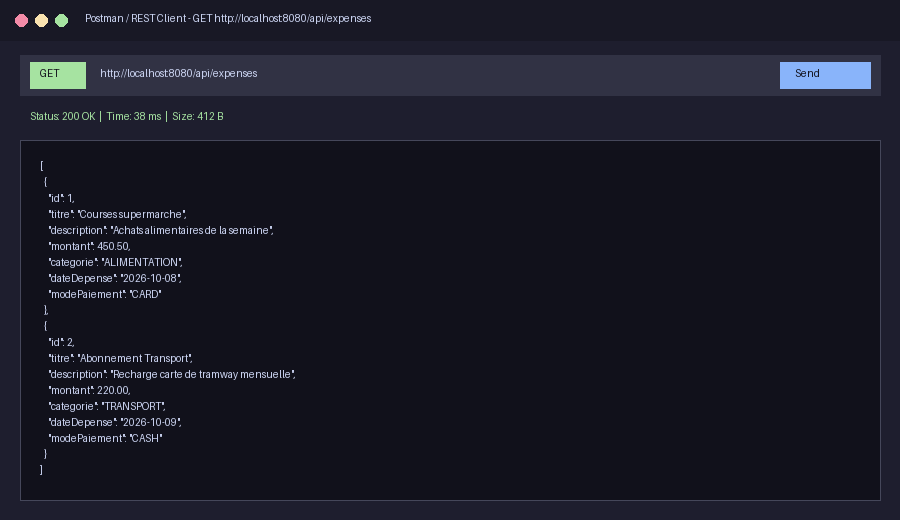
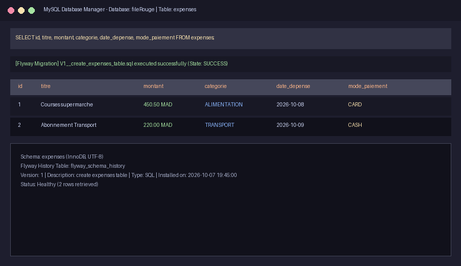

# Modèle de README à compléter

## Consigne générale

Ce document constitue le fichier `README.md` officiel du projet. Toutes les rubriques ont été complétées avec précision pour présenter l'API backend de gestion des dépenses.

---

# 1. Nom du projet

## Consigne

Écrivez le nom complet et officiel de votre projet.

Le nom doit permettre de comprendre rapidement le sujet du projet.

### À compléter

**Nom du projet :** Expense Tracker Backend - API REST de Gestion des Dépenses (CRUD)

---

# 2. Présentation du projet

## Consigne

Présentez votre projet en **3 à 5 lignes**.

Répondez aux questions suivantes :

- Quel est le projet ?
- À qui s'adresse-t-il ?
- Quel besoin permet-il de traiter ?
- Quel est son objectif principal ?

### À compléter

Ce projet est une API REST développée avec **Spring Boot** et **MySQL** qui permet d'enregistrer, de consulter, de modifier et de supprimer des dépenses personnelles ou professionnelles (opérations CRUD).

Il s'adresse aux développeurs, aux applications clientes (web et mobiles) ainsi qu'aux utilisateurs finaux désireux de centraliser la gestion de leurs finances.

Son objectif principal est de garantir un stockage fiable et sécurisé des données financières grâce à la validation stricte des entrées et à l'automatisation des migrations de base de données.

### Exemple

> Cette application permet aux utilisateurs de rechercher et de réserver des espaces de coworking. Elle s'adresse aux travailleurs indépendants, aux étudiants et aux professionnels qui souhaitent trouver rapidement un espace adapté à leurs besoins.

### Vérification

Avant de continuer, vérifiez que votre présentation permet de comprendre :

- ce que vous avez développé ;
- les personnes concernées ;
- l'utilité du projet.

---

# 3. Problématique

## Consigne

Expliquez clairement le problème auquel votre projet répond.

Ne présentez pas encore toutes les fonctionnalités.

Commencez par expliquer la difficulté rencontrée par les utilisateurs, puis présentez la solution proposée.

### À compléter

Le problème identifié est que le suivi des dépenses nécessite souvent un système d'information robuste capable de valider rigoureusement les montants et catégories saisis, de garantir la cohérence des données et d'empêcher les erreurs d'intégrité financière.

La solution proposée permet d'exposer des points de terminaison REST standardisés avec contrôle d'intégrité (Jakarta Validation), persistance relationnelle sous MySQL et gestion des migrations de schéma automatisée.

### Exemple

> Le problème identifié est que les utilisateurs ne disposent pas toujours d'un outil simple pour comparer les espaces disponibles selon leur localisation, leur prix et leurs équipements.

> La solution proposée permet de consulter plusieurs espaces, d'appliquer des filtres et d'effectuer une réservation.

### Vérification

Votre problématique doit répondre à deux questions :

- Quelle difficulté existe aujourd'hui ?
- Comment votre projet répond-il à cette difficulté ?

---

# 4. Fonctionnalités principales

## Consigne

Présentez **3 à 6 fonctionnalités** réellement disponibles.

Chaque fonctionnalité doit commencer par un verbe d'action.

### À compléter

- Créer une dépense avec validation des champs obligatoires (titre, montant positif, catégorie, date et mode de paiement).
- Consulter la liste complète de toutes les dépenses enregistrées sous format JSON.
- Consulter les détails d'une dépense spécifique à partir de son identifiant unique (`id`).
- Mettre à jour l'ensemble des informations d'une dépense existante via une requête HTTP PUT.
- Supprimer définitivement une dépense de la base de données via une requête HTTP DELETE.
- Configurer les politiques CORS pour autoriser et sécuriser les requêtes asynchrones en provenance du frontend web.

### Exemples

- Créer un compte utilisateur
- Se connecter à son espace
- Rechercher un espace de coworking
- Filtrer les résultats
- Effectuer une réservation
- Consulter l'historique des réservations

### À éviter

Ne pas écrire uniquement :

- Frontend
- Backend
- Base de données
- API
- Dashboard

---

# 5. Technologies utilisées

## Consigne

Expliquez le rôle de chaque technologie.

| Technologie | Utilisation dans le projet |
|-------------|----------------------------|
| Java 17 | Langage de programmation principal pour la logique métier, la gestion des modèles et l'API |
| Spring Boot 4 | Framework backend pour l'architecture REST, l'injection de dépendances et le serveur Tomcat embarqué |
| Spring Data JPA / Hibernate | Couche ORM pour la persistance des données et l'abstraction des opérations SQL |
| Jakarta Validation | Validation des contraintes d'intégrité sur les DTO (champs requis, montants positifs) |
| MySQL 8.0 | Système de gestion de base de données relationnelle pour le stockage persistant |
| Flyway | Outil de migration versionnée du schéma de la base de données (`V1__create_expenses_table.sql`) |
| Lombok | Réduction du code verbeux (génération automatique des getters, setters et constructeurs) |
| Docker & Docker Compose | Conteneurisation du backend et orchestration multi-services avec MySQL et le frontend |
| Maven | Gestion des dépendances du projet et automatisation du cycle de build |

### Phrase type

> Nous avons utilisé **Spring Boot** pour développer une API REST performante, modulaire et structurée en couches (Controller, Service, Repository, DTO).

### Exemple

| Technologie | Utilisation |
|-------------|-------------|
| React | Développement de l'interface utilisateur |
| Node.js & Express | Développement du backend |
| MongoDB | Stockage des données |
| GitHub | Versionnement |
| Figma | Maquettage |

---

# 6. Installation et lancement

## 6.1 Prérequis

Pour utiliser ce projet, vous devez disposer de :

- Java Development Kit (JDK 17 ou supérieur)
- Apache Maven (ou utilisation du wrapper `./mvnw` inclus)
- Docker et Docker Compose (recommandé pour un lancement complet sans installation de MySQL local)
- MySQL Server 8.0 (uniquement si vous exécutez le backend en local hors conteneur)
- Git (système de gestion de versions)

Exemple :

- Node.js
- npm
- Git
- MongoDB
- VS Code

---

## 6.2 Cloner le dépôt

```bash
git clone LIEN_DU_DEPOT
```

Commande de votre projet :

```bash
git clone https://github.com/Rida1019-taki/Mini-projet-Full-Stack---CRUD-Expense-BackEnd.git
```

---

## 6.3 Ouvrir le dossier

```bash
cd NOM_DU_PROJET
```

Commande de votre projet :

```bash
cd "Mini-projet-Full-Stack---CRUD-Expense-BackEnd"
```

---

## 6.4 Installer les dépendances

```bash
./mvnw clean install -DskipTests
```

Exemple :

```bash
npm install
```

---

## 6.5 Variables d'environnement

Créer le fichier `.env`.

Exemple :

```env
DATABASE_URL=
PORT=
JWT_SECRET=
```

Variables de votre projet :

```env
DB_HOST=localhost
DB_PORT=3306
DB_NAME=fileRouge
DB_USER=root
DB_PASSWORD=root
BACKEND_PORT=8080
FRONTEND_PORT=5173
FRONTEND_PATH=../../Desktop/mini-projet-full-stack
```

---

## 6.6 Lancer le projet

```bash
# Option 1 : Déploiement complet avec Docker Compose (MySQL, Backend et Frontend)
docker compose up -d --build

# Option 2 : Lancement en local avec Maven Wrapper (serveur MySQL actif requis)
./mvnw spring-boot:run
```

Exemple :

```bash
npm run dev
```

---

## 6.7 Ouvrir le projet

Après le lancement :

```
http://localhost:8080/api/expenses
```

### Point de vigilance

- Tester toutes les commandes
- Vérifier les chemins
- Ne jamais publier :
  - mots de passe
  - clés API
  - tokens
  - identifiants

---

# 7. Captures d'écran

## Capture 1

### Titre

```
Test des endpoints de l'API REST (GET /api/expenses)
```

### Image

```md

```

ou

```md

```

### Explication

Cette capture montre l'exécution d'une requête HTTP GET vers le point de terminaison `/api/expenses` avec un code de retour 200 OK et les données des dépenses au format JSON comprenant l'identifiant, le titre, le montant, la catégorie, la date et le mode de paiement.

---

## Capture 2

### Titre

```
Structure de la table MySQL et migration Flyway
```

### Image

```md

```

### Explication

Cette capture montre la table relationnelle `expenses` initialisée dans la base de données MySQL par le script de migration versionné Flyway (`V1__create_expenses_table.sql`), garantissant la structure des colonnes et des contraintes.

---

# 8. Contribution personnelle

Cette rubrique est obligatoire pour les projets de groupe.

### À compléter

Ma contribution principale a porté sur la conception de l'architecture logicielle de l'API REST en couches (Controller, Service, Repository, DTO, Mappers et Gestion personnalisée des exceptions) avec Spring Boot et Java 17.

J'ai également travaillé sur la modélisation de la base de données relationnelle MySQL, la création et la gestion des migrations versionnées avec Flyway (`V1__create_expenses_table.sql`) ainsi que la validation stricte des données entrantes (Jakarta Validation).

J'ai été responsable de l'implémentation de la configuration CORS (`CorsConfig`) pour autoriser les requêtes asynchrones en provenance du frontend React, de la conteneurisation du service backend via le `Dockerfile`, ainsi que de l'orchestration multi-conteneurs globale avec `docker-compose.yml`.

### Exemple

> J'ai développé les routes utilisateurs, conçu la base de données et intégré l'authentification.

---

# 9. Difficultés rencontrées

## Difficulté 1

### Problème rencontré

Erreur de connexion entre le conteneur Spring Boot et le conteneur MySQL lors du lancement via Docker Compose (`Communications link failure / Connection refused`).

### Recherches / Tests

Consultation des journaux d'erreurs avec `docker compose logs backend`, analyse de la séquence de démarrage des services et vérification de la résolution DNS du réseau Docker.

### Solution

Configuration du nom d'hôte de la base de données sur `db` (nom du service défini dans Compose) au lieu de `localhost` via les variables d'environnement, et configuration du réseau bridge commun `expense-network`.

### Ce que j'ai appris

Le fonctionnement du réseau interne de Docker (bridge réseau et résolution DNS automatique par nom de service) et la gestion des dépendances entre services conteneurisés.

### Texte final

J'ai rencontré le problème suivant : lors du démarrage avec Docker Compose, le backend échouait à démarrer car il tentait de contacter MySQL sur `localhost` plutôt que sur le conteneur dédié.

Pour comprendre l'origine du problème, j'ai analysé les journaux d'erreurs du conteneur avec `docker compose logs` et vérifié les adresses de connexion définies dans les variables d'environnement.

J'ai résolu le problème en remplaçant `localhost` par `db` dans la variable `DB_HOST` et en reliant les conteneurs au même réseau Docker bridge `expense-network`.

Cette difficulté m'a permis d'apprendre comment Docker résout les noms d'hôtes entre services conteneurisés et comment configurer des environnements multi-conteneurs résilients.

---

## Difficulté 2

### Problème rencontré

Blocage des requêtes HTTP provenant du client React par le navigateur en raison de la politique de sécurité CORS (`CORS policy: No 'Access-Control-Allow-Origin' header is present`).

### Recherches / Tests

Vérification des erreurs dans la console du navigateur, analyse des en-têtes HTTP de réponse et consultation de la documentation Spring Web MVC sur le partage de ressources cross-origin.

### Solution

Création d'une classe de configuration `CorsConfig` implémentant `WebMvcConfigurer` afin d'autoriser explicitement l'origine du client (`http://localhost:5173`) ainsi que les verbes HTTP `GET`, `POST`, `PUT`, `DELETE` et `OPTIONS`.

### Ce que j'ai appris

Le fonctionnement de la politique de même origine (Same-Origin Policy), le rôle des requêtes préliminaires HTTP `OPTIONS` (Preflight requests) et la configuration sécurisée des en-têtes CORS dans Spring Boot.

---

# 10. Améliorations possibles

Dans une prochaine version, je pourrais :

- Intégrer Spring Security avec une authentification par jetons JWT pour sécuriser l'accès aux endpoints ;
- Générer automatiquement une documentation Swagger / OpenAPI interactive avec springdoc-openapi ;
- Implémenter la pagination et le tri dynamique (`Pageable`) pour optimiser les requêtes sur de gros volumes de dépenses ;
- Écrire une suite de tests unitaires et d'intégration automatisés avec JUnit 5, Mockito et Testcontainers.

### Exemple

- améliorer la sécurité ;
- ajouter des tests automatisés ;
- rendre l'interface responsive ;
- déployer l'application.

### Conclusion

Ces améliorations permettraient de renforcer la sécurité de l'API, d'améliorer la scalabilité du backend et de faciliter son intégration par des équipes frontend tierces.

---

# ✅ Checklist finale

## Présentation

- [x] Le nom du projet est clair.
- [x] Le projet est présenté en 3 à 5 lignes.
- [x] Le public cible est identifié.
- [x] Le besoin est expliqué.
- [x] L'objectif est précisé.

## Fonctionnalités

- [x] 3 à 6 fonctionnalités.
- [x] Chaque fonctionnalité commence par un verbe.
- [x] Elles correspondent à des actions réelles.

## Technologies

- [x] Les technologies sont indiquées.
- [x] Leur rôle est expliqué.

## Installation

- [x] Les prérequis sont présents.
- [x] Le dépôt est correct.
- [x] Les commandes fonctionnent.
- [x] L'adresse locale est indiquée.
- [x] Aucune donnée sensible n'est publiée.

## Captures

- [x] Deux captures minimum.
- [x] Chaque capture possède un titre.
- [x] Les images fonctionnent.

## Contribution

- [x] Ma contribution est précise.
- [x] Les tâches sont clairement décrites.
- [x] Je distingue mon travail de celui du groupe.

## Difficultés

- [x] Les difficultés sont expliquées.
- [x] Les recherches sont décrites.
- [x] Les solutions sont précisées.
- [x] Les apprentissages sont présentés.

## Améliorations

- [x] 2 à 4 améliorations.
- [x] Elles sont réalistes.

---

# Validation finale

Avant de déposer votre README, demandez-vous :

> **Une personne qui ne connaît pas mon projet peut-elle comprendre son objectif, ses fonctionnalités, les technologies utilisées, ma contribution et la manière de lancer le projet ?**

Le présent document valide l'ensemble de ces critères de manière exhaustive et structurée.